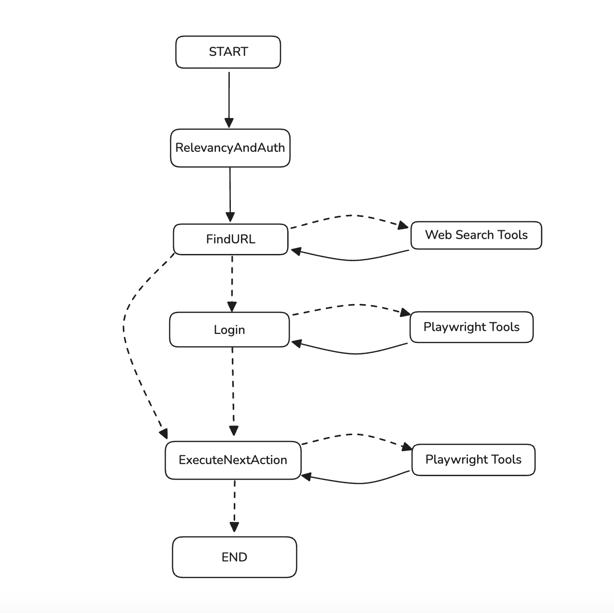

# Browser Automation AI Agent

An AI Agent that automates and executes a workflow/process based on natural language instructions using a web browser and also captures screenshots of the UI states of the workflow. The system uses an AI Agent architecture to understand user intents and perform browser automation tasks using Playwright MCP Server and captures/screenshots the UI states.

## Features

- **Natural Language Processing**: Understands user queries in plain English
- **Automated Web Interactions**: Performs actions like clicking, typing, and navigating
- **Screenshot Capture**: Takes screenshots of relevant UI elements or pages
- **Human-in-the-Loop**: Optional approval before executing automation steps
- **Integration with AI Models**: Uses Google's Generative AI for processing queries

## AI Agent Architecture


## Prerequisites

- Node.js (v16 or higher)
- pnpm package manager
- Google Gemini API key
- Brave Search API key (for web searches)
- Playwright for browser automation

## Installation

1. Clone the repository:
   ```bash
   git clone https://github.com/abhignakumar/browser-automation-ai-agent
   cd browser-automation-ai-agent
   ```

2. Install dependencies:
   ```bash
   pnpm install
   ```

3. Set up environment variables:
   - Copy `.env.example` to `.env`
   - Fill in the required API keys and configuration

## Configuration

Create a `.env` file with the following variables:

```
MODEL_NAME=your_model_name      # gemini-2.5-flash
GEMINI_API_KEY=your_gemini_api_key
BRAVE_API_KEY=your_brave_api_key
SCREENSHOT_DIR=/path/to/save/screenshots
PLAYWRIGHT_MCP_OUTPUT_DIR=/path/to/playwright/output       # For MacOS: /private/tmp/playwright-mcp-output
```

## Usage

1. Update the query in `src/index.ts` with your desired action:
   ```typescript
   const query = `How to create a task with a due date in Asana?`;
   ```

2. Run the application:
   ```bash
   pnpm dev
   ```

   Or build and run:
   ```bash
   pnpm build
   pnpm start
   ```

## How It Works

1. The agent processes the natural language query
2. Determines the necessary web interactions
3. Optionally requests human approval before execution
4. Performs the web automation using Playwright
5. Captures and saves relevant screenshots
6. Returns the path to the saved screenshots

## Project Structure

- `src/`
  - `agent.ts` - Main agent implementation
  - `index.ts` - Entry point and example usage
  - `mcp-client.ts` - MCP (Model Control Protocol) client
  - `prompts.ts` - System prompts for the AI
  - `types.ts` - TypeScript type definitions
  - `utils.ts` - Utility functions

## Dependencies

- `@google/genai`: Google's Generative AI SDK
- `playwright`: Browser automation
- `@modelcontextprotocol/sdk`: Model Context Protocol SDK